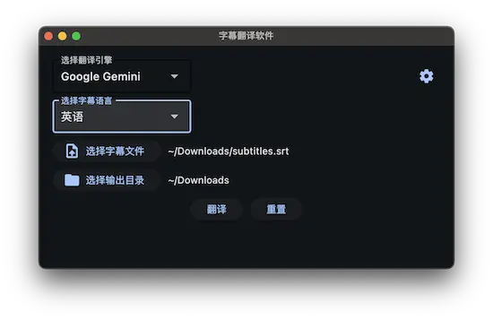

# subtiltes-translator

大概只能运行在 Linux/macOS 系统上，还有一大堆 bug 需要解决哦...

### 软件预览



### 使用方法

在使用之前，你需要有以下依赖：

- Python 3.12+
- [pdm](https://pdm-project.org/) 或者 [uv](https://github.com/astral-sh/uv)

安装依赖：

```bash
pdm install
pdm run python main.py

# or

uv sync
uv run python main.py
```

### TODO

- [ ] 支持更多翻译引擎 (OpenAI, Claude)
- [ ] 支持更多字幕格式 (ass)
- [ ] 修复大量 Bug
